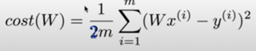
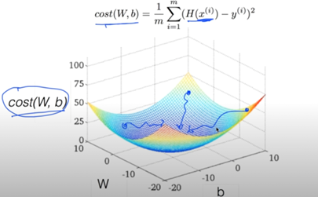
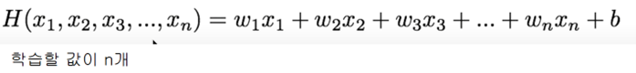
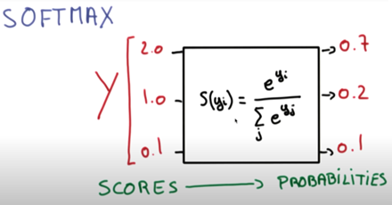

요약:
	[Linear Regression]
	H(x) = Wx + b
	H(x): 가설 함수
	W: 가중치(weight)
	b: 편향(bias)
	x: 요소

	결과에 영향을 미치는 요소와 그에 따른 결과를 학습 데이터로 주면
	가장 정확한 H(x)를 찾기 위한 W와 b를 구하는 알고리즘

	결과에 영향을 미치는 요소 x1, x2, x3 이 있을 때:
	y = w1x1 + w2x2 + w3+x3 + b

Machine Learning: 데이터를 학습을 하는 프로그램
Supervised Learning: 트레이닝셋(라벨링된 데이터)를 기반으로 학습
Unsupervised Learning: 라벨링되기 힘든 데이터(신문 제목, 단어 분류)를 기반으로 학습

ML로 해결할 수 있는 문제들
 - 이미지 라벨링
 - 스팸메일 분류
 - 시험 성적 예측

Training data set

Supervised learning 종류:
	- Regression: 범위(1~n)중에서 예측
	- binary classification: 두가지 결과 중에서 예측
	- multi-label classification: 다수의 결과 중에서 예측

Regression은 기본적으로 2차원 그래프 데이터 사용
Linear Hypothesis: 정비례 2차원 그래프를 가진 가설
Cost function: 실제 값과 데이터 값의 차이를 표현해주는 함수

cost를 최소화하는 W, 와 b를 구하는 것이 학습의 목표

Simplified hypothesis:

비용함수 그래프의 개형:

연산 예시:

Gradient descent algorithm:
 한 지점에서 y값이 감소하는 방향으로 한 단위 씩 이동
 최종적으로 y값이 최소인 x값에 도달
 기울기를 구해야 하기 때문에 미분을 사용, 연산의 편의를 위해 분모에 *2

최종 Gradient descent algorithm

Gradient descent algorithm을 사용할 수 있는 cost 함수의 그래프(convex 형태)
만약 위와 다르게 울퉁불퉁하다면 서로 다른 지점에서의 도착점이 다를 수 있음

[학습할 값이 복수인 경우]

행렬의 곱으로 표시:

Logistic(Binary) Classification:
 - 둘 중 하나를 고르는 분류 ex) 스팸인가 아닌가?
 - 0 or 1로 결과 반환
 - 0 ~ 1 범위에서만 반환 시키기 위해 시그모이드 함수 사용

Logistic classification hypothesis funciton:

Logistic classification hypothesis cost function:

결과적으로 가설이 맞으면 비용이 0에 수렴 가설이 틀리면 비용이 발산

최종 cost function:

Logistic classification gradient decent algorithm:

Softmax Regression(Multinomial classification):

-> 2.0 , 1.0, 0.1 을 모두 더하면 1이되는 값으로 변환(Softmax 함수)

one-hot encoding: 가장 큰 값을 1로 나머지는 0으로 변환 위사진에선 1 / 0 / 0

Cost function:

Gradient descent:

[ML에서 생길 수 있는 문제들]

Overshooting:
	- Gradient descent 알고리즘의 learning late가 과도하게 커서 cost가 발산하는 현상
	- 단 learning late가 너무 작으면 시간이 오래 걸리고 최소 비용에 도달하지 못할 수 있음
	- learning rate을 처음에는 0.01로 설정하는 것이 권장됨
Overfitting:
	- 학습데이터가 학습에는 적합하나 실사용과 괴리감이 커서 생기는 문제
	- 표본 트레이닝 데이터를 늘리기
	- features 개수 줄이기
	- 일반화 시키기